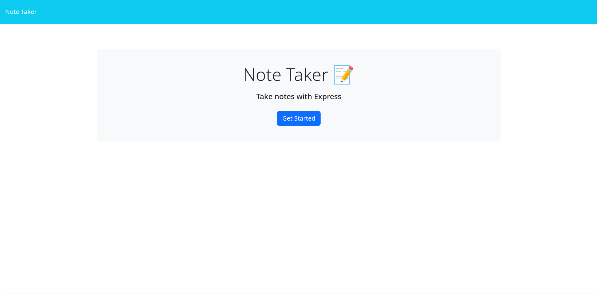
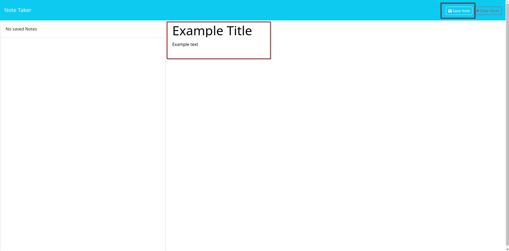
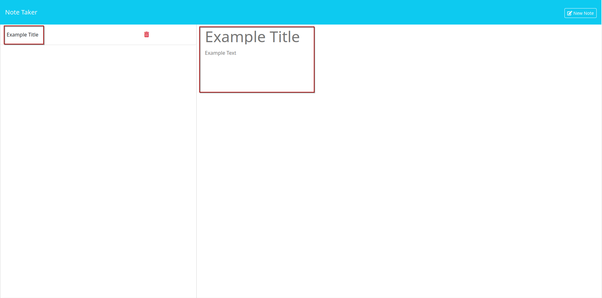
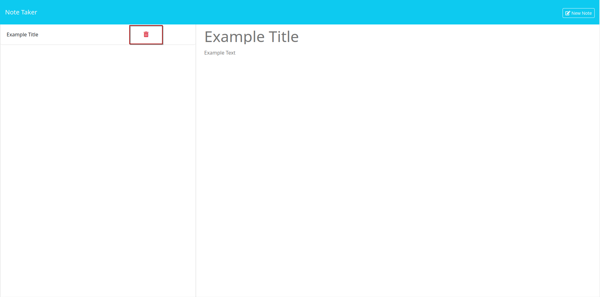

# Note-Taker

## Description

 Note Taker is a web application that can be used to write and save notes. It uses an Express.js backend that saves and retrives note data from a JSON file.

## Usage

### Starting the application

Start using the application by clicking the 'Get Started' button on the landing page.

You'll be redirected to a new page where you can create, view, and delete notes.

### Creating Notes

To create a note, fill the note title and note text, and click the 'Save Note' button.

### Viewing Notes

Once saved, the note will be listed on the left side. To view the content again, just click the note title. The content will be displayed in the same place where we previously wrote it.

### Deleting Notes

To delete a note, simply click the trash icon next to the note title.

